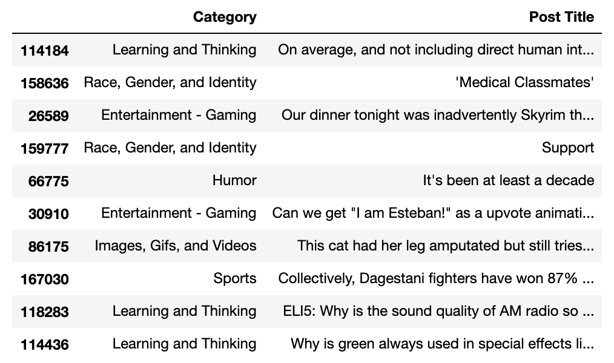
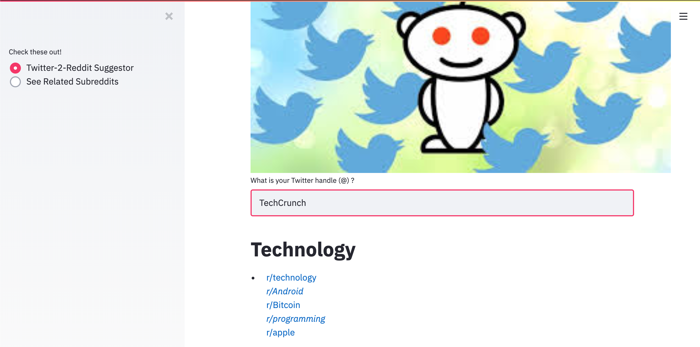
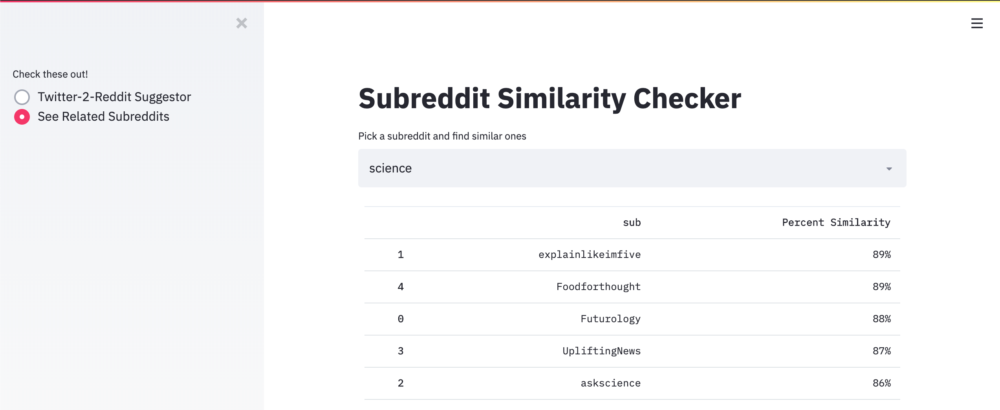

# Twit-To-Redd-Project
Using Natural Language Processing to suggest subreddits from Reddit based on specified Twitter user "likes".

# Goal of the Project
To bridge the gap between Twitter users and Reddit users, as many people who enjoy one form of social media/entertainment enjoy the other. The app will take your Twitter handle, and recommend subreddits (forums dedicated to specific topics on Reddit) based on liked tweets. Then, the user will be able to look up these suggested subreddits in a searchbox that finds them a short list of other similar subreddits. The entire interactive process is done in seconds!

# The Data

In order to train a model to classify tweets into a certain "category" of subreddits, it needs to be trained on those different categories. The following 14 categories were selected based on [this Reddit post](https://www.reddit.com/r/TheoryOfReddit/comments/1f7hqc/the_200_most_active_subreddits_categorized_by/):
* Discussion and Stories 
* Emotional Reaction Fuel
* Entertainment - Gaming
* Entertainment - Television
* Entertainment - Other (Movies/Music/Franchies/Misc) 
* Humor
* Images, Gifs, and Videos
* Learning and Thinking
* Lifestyle and Help
* News and Issues
* Places
* Race, Gender, and Identity
* Sports
* Technology

Each category had 5-25 subreddits in it; The titles of the top 1000 posts from each subreddit are scraped in order to get a large corpus for each category. This results in the acquisition of ~170,000 posts.

# The First Model

A Doc2Vec Model proved to be effective for this scenario because of its ability to analyze meanings of not only words, but groups of words/sentences/corpora at once. The classification model trains on the data from the DataFrame above, with the intent of taking just a few words or sentences(like a reddit post title, or a tweet), and predict the proper category for it.

# Twitter's API

User "liked" tweets are grabbed upon entering the user's Twitter handle, which is then used for multiple requests from Twitter's API. The tweets are then cleaned to remove unnecessary characters like stopwords(the, a, or, is) and emojis. Then, the tweets are vectorized to calculate a similarity comparison to the text in the 14 categories, and the most similar category is returned. This is the first part of the application.

# The App

A frontend was established using Streamlit, providing an easy-to-use user interface for the project. Here is an example of the app suggesting an appropriate category of subreddits for a popular Twitter technology account, @TechCrunch:

# The Second Model

Next, with the goal of really customizing a tailored list of subreddits for the user, I set out to acquire more data on subreddits **related** to the list of ~170 subreddits I have now. After compiling a list of ~580 subreddits and the top 1000 post titles from them, I wanted to include a second phase to the app that allows a user to select a subreddit, perhaps from the list they were already recommended in the first phase, and to suggest *more* subreddits using another, separate Doc2Vec model. This time, this model was trained on the text of all of the related subreddits, calculating a similarity score between each one.

Going to the second tab on the application, the user will notice a text input/dropdown box that allows them to type in/select one of the subreddits, and immediately calculates and returns the five most similar subreddits in terms of what is being discussed on them. Here is an example looking for subreddits similar to "science":

For an added peek at what terms are actually being discussed on the subreddit, the application also quickly pulls up a word cloud for the particular subreddit that was selected:

